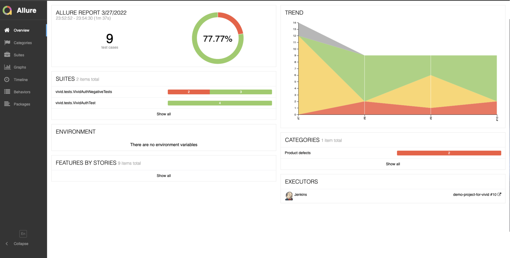
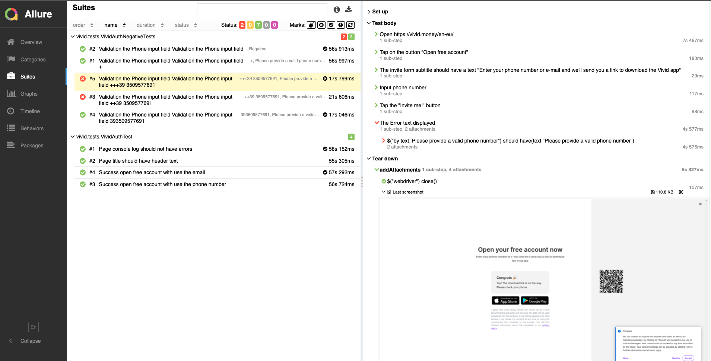
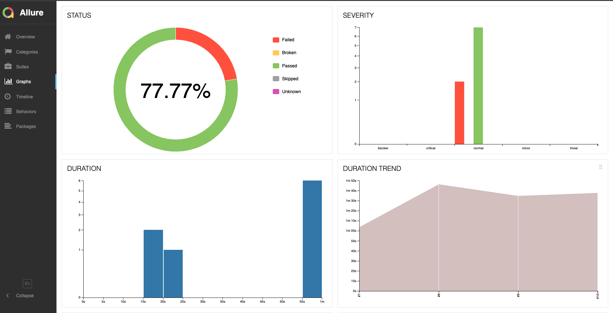
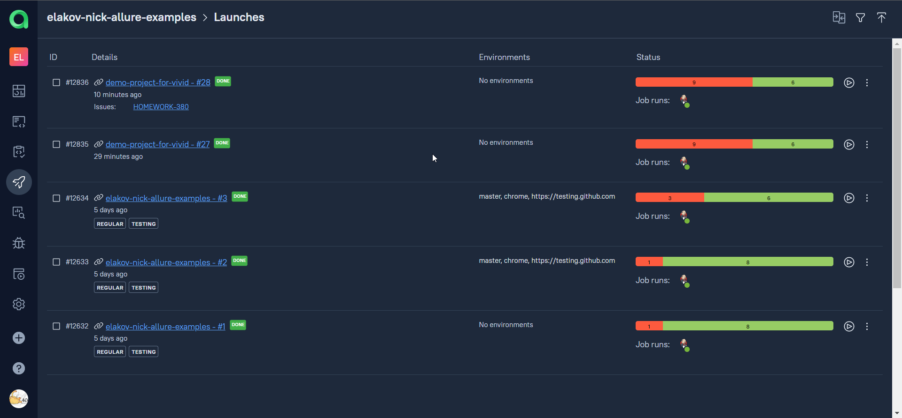
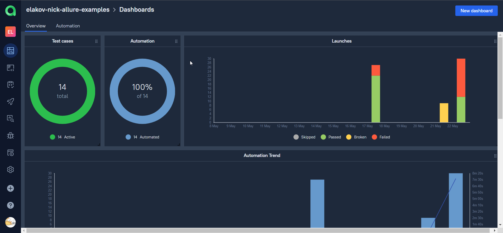
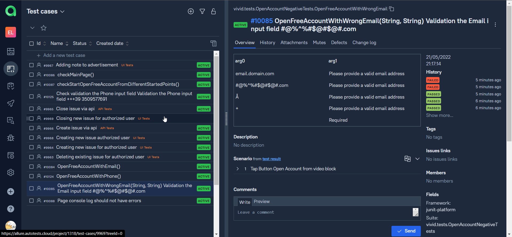
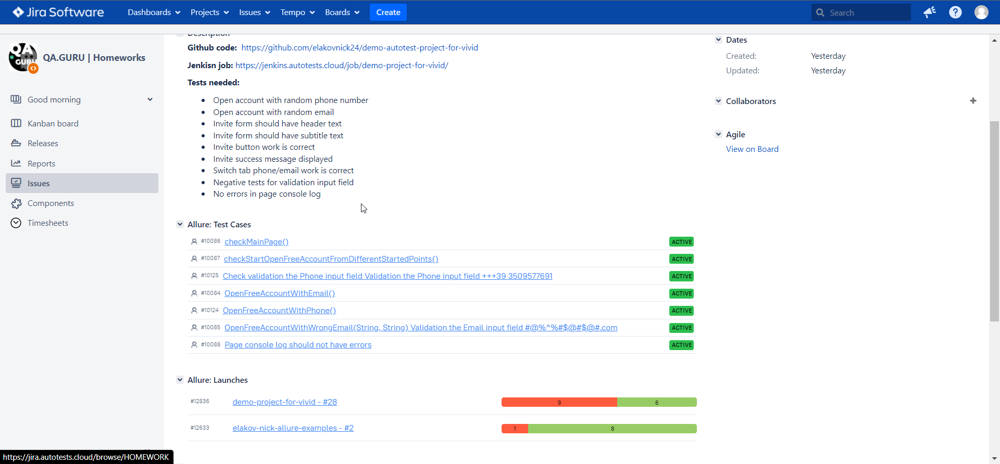
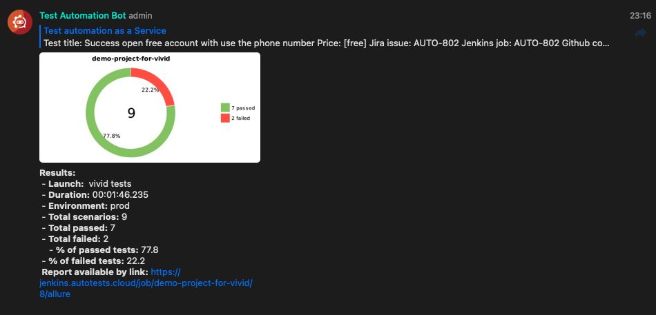
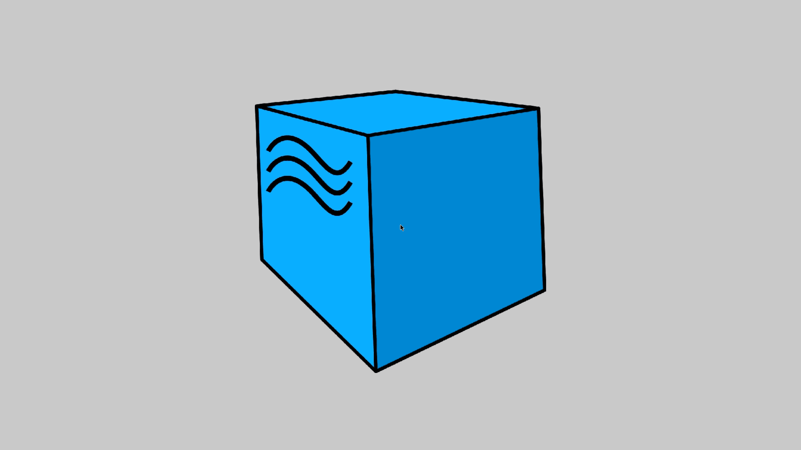

<h1 align="center">Vivid Money UI Tests</h1>

<p align="center">
  <i>End-to-end UI tests for the Vivid Money web app.</i>
</p>

<p align="center">
  
  
  
  
  
  
</p>

## Overview

UI tests that drive the live **Vivid Money** web app end-to-end, built on the Page Object Model. They run locally with one command or on a remote **Selenoid** Docker grid, run in parallel, and produce an **Allure** report with screenshots, page source, browser console logs, and a session video on each test. CI runs on **Jenkins** and posts the results to **Telegram**.

## Covered functionality

### UI

- [x] Open account with random phone number
- [x] Open account with random email
- [x] Invite form should have header text
- [x] Invite form should have subtitle text
- [x] Invite button work is correct
- [x] Invite success message displayed
- [x] Switch tab phone/email work is correct
- [x] Negative tests for validation input field
- [x] No errors in page console log

## Technology stack

<p align="center">


</p>

> <code>Selenide</code> drives the UI · <code>Selenoid</code> runs browsers in <code>Docker</code> · <code>Allure</code> reports each run · <code>Gradle</code> (Kotlin DSL) builds · <code>JUnit 5</code> is the test engine · <code>Jenkins</code> runs CI · <code>Telegram</code> delivers the result.

### Key versions

| Tool | Version |
|------|---------|
| Java | 25 |
| Gradle | 9.5.1 (wrapper) |
| Selenide | 7.16.2 |
| JUnit | 5.14.4 |
| Allure | 2.35.2 |
| AssertJ | 3.27.7 |
| Datafaker | 2.5.4 |
| AspectJ weaver | 1.9.25.1 |
| slf4j-simple | 2.0.18 |

### Project layout

```
src/test/java/vivid/
  config/       Project.java · ProjectConfig.java     # plain Properties config (-D overrides + config/<profile>.properties)
  helpers/      DriverSettings · DriverUtils · AllureAttachments
  tests/        TestBase + *Tests.java
  tests/pages/  MainPage · OpenAccountPage             # Page Object Model
src/test/resources/config/  <profile>.properties        # gitignored; *.example committed
docker-compose.yml · selenoid/browsers.json             # local Selenoid grid
build.gradle.kts                                         # Gradle Kotlin DSL
```

UI interaction lives in the page objects; tests drive them through fluent chains. Configuration uses no third-party library: a missing key resolves to `""`, and `baseUrl` fails fast if left unset.

## Running tests from the terminal

### Prerequisites

> <code>JDK 25</code>. The build targets Java 25 via Gradle toolchains.
>
> No local Gradle install required; the project ships a Gradle wrapper (`./gradlew`).

### Running Tests Locally

```bash
./gradlew clean test                       # run all tests
./gradlew clean test -Dbrowser=chrome      # choose browser
./gradlew clean test -Dthreads=4           # parallel run, N threads
```

Settings (`baseUrl`, `browser`, `browserSize`, `browserVersion`, `remoteDriverUrl`, `videoStorage`)
are read from JVM system properties (`-Dkey=value`), with an optional classpath file
`config/<profile>.properties` selected via `-Dproperties=<profile>`. A local run needs at least
the application URL, e.g. `./gradlew clean test -DbaseUrl=https://vivid.money/en-eu/ -Dbrowser=chrome`.

### Viewing the Allure report locally

```bash
./gradlew allureServe     # build and open the report in a browser
./gradlew allureReport    # generate a static report into build/reports/allure-report
```

### Running against a local Selenoid grid

```bash
docker compose up -d                       # start Selenoid + Selenoid UI
docker pull selenoid/vnc_chrome:128.0      # pull the browser image (one-time)
./gradlew clean test -Dproperties=remote   # run the suite against the grid
```

> Selenoid UI: http://localhost:8080 · grid: http://localhost:4444/wd/hub · recorded videos: `selenoid/video/`
>
> Profile lives in `src/test/resources/config/remote.properties` (copy from `remote.properties.example`); browser images/versions in `selenoid/browsers.json`. Keep the version in `remote.properties` (`browserVersion`) in sync with the image you pull.

### Remote test running

## </a> Jenkins <a target="_blank" href="https://jenkins.autotests.cloud/job/demo-project-for-vivid/"> job </a>

```
clean
test
-Dbrowser=${BROWSER}
-DbrowserVersion=${BROWSER_VERSION}
-DbrowserSize=${BROWSER_SIZE}
-DremoteDriverUrl=https://user1:1234@${REMOTE_DRIVER_URL}/wd/hub/
-DvideoStorage=https://${REMOTE_DRIVER_URL}/video/
-Dthreads=${THREADS}
```

### New remote test running

```
clean
test
-Dproperties=remote
```

### Build Options

> <code>REMOTE_URL</code> – the address of the remote server where the tests will run.
>
> <code>BROWSER</code> – the browser the tests will be run (_default - <code>chrome</code>_).
>
> <code>BROWSER_VERSION</code> – version of the browser the tests will be run (_e.g. <code>128.0</code>, must match a Selenoid image_).
>
> <code>BROWSER_SIZE</code> – the size of the browser window the tests will be run (_default - <code>1920x1080</code>_).

### Main page of <a target="_blank" href="https://jenkins.autotests.cloud/job/demo-project-for-vivid/8/allure/">Allure-report</a>

<p align="center">

</p>

### Grouping tests by tested functionality

<p align="center">

</p>

### Main dashboard

<p align="center">

</p>

##  Integration with Allure Test Ops

### Launches

<p align="center">

</p>

### Custom dashboard

<p align="center">

</p>

### Test cases 

<p align="center">

</p>

##  Integration with Jira
> Also you can setting export your information to Jira about launches and test cases

<p align="center">

</p>

##  Telegram notifications using a bot

> After the build is completed, a special bot created in <code>Telegram</code> automatically processes and sends a message with a run report.

<p align="center">

</p>

##  An example of running a test in Selenoid

> A video is attached to each test in the report. Two of these videos is shown below.

```Positive test```
<p align="center">
  
</p>

```Negative test```
<p align="center">
  
</p>
